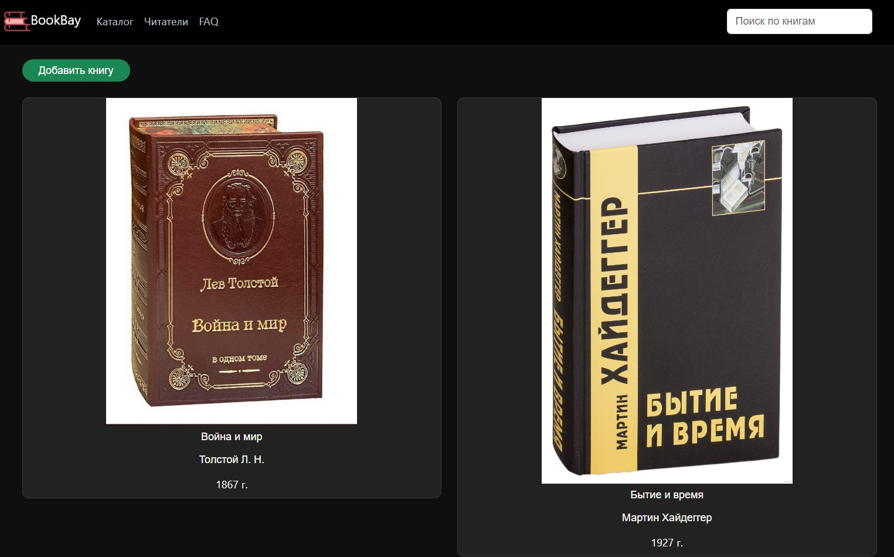
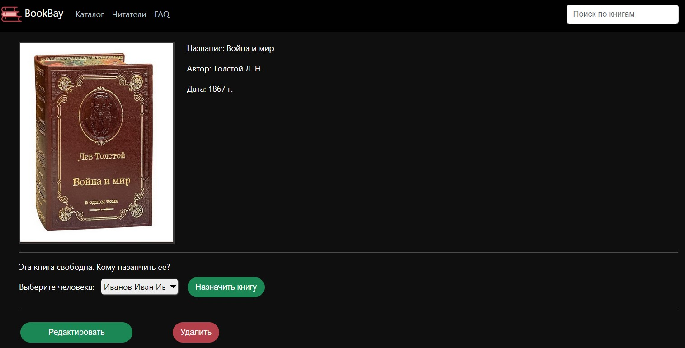

# Цифровая Библиотека

Веб-приложение для выполнения основных
функций библиотеки, система контроля всех этапов
работы цифровой библиотеки (система имеет возможность отслеживать и контролировать работу пользователей и библиотекарей,
обеспечивая эффективность и безопасность библиотеки)

## Постановка задачи

Цель - предоставить пользователям возможность использовать цифровую библиотеку для выполнения
основных функций библиотеки, а также обеспечить систему контроля всех этапов работы цифровой библиотеки.

Данное приложение включает в себя систему управления библиотечными ресурсами, которая обеспечивает контроль
над добавлением, редактированием и удалением книг, а также управление пользователями и их правами доступа.

Таким образом, целью данного приложения является предоставление удобного и эффективного инструмента для управления
цифровой библиотекой и обеспечения контроля за ее работой.

## Запуск программы

1. клонирование репозитория `git clone https://github.com/EMIR1HUB/Library_WebProject.git`
2. добавление файла `application.properties` в пакет resources
3. настройка файла `application.properties`
```properties
# ===============================
# DATABASE
# ===============================
db.driver=org.postgresql.Driver
db.url=jdbc:postgresql://localhost:5432/название БД
db.username=
db.password=

upload.path=полный путь расположение файлов

# ===============================
# JPA / HIBERNATE
# ===============================
spring.jpa.show-sql=true
spring.jpa.hibernate.ddl-auto=none
spring.jpa.properties.hibernate.dialect=org.hibernate.dialect.PostgreSQL82Dialect
spring.jpa.properties.hibernate.current_session_context_class=org.springframework.orm.hibernate5.SpringSessionContext

# Fix Postgres JPA Error:
# Method org.postgresql.jdbc.PgConnection.createClob() is not yet implemented.
spring.jpa.properties.hibernate.temp.use_jdbc_metadata_defaults=false
```

## Диаграмма классов


___

### Добавление книг


___
### Вывод всех позиций


___
### Редактирование книг


___
### Назначение и освобождение книги


___
### Вывод пользователей


___
### Вывод данных пользователя


___
### Редактирование пользователя


