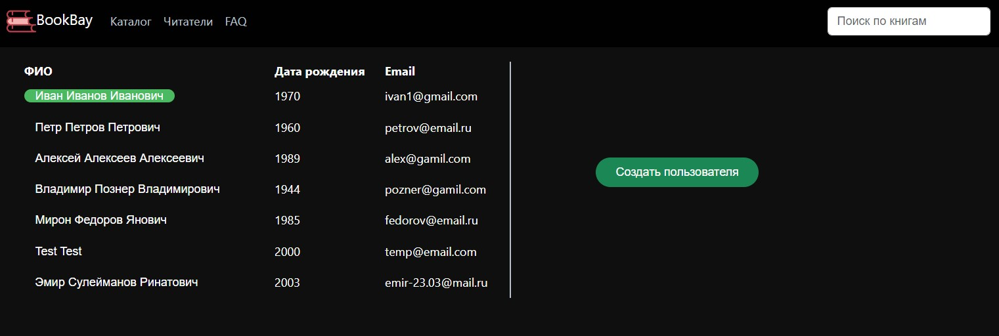

# Цифровая Библиотека

Веб-приложение для выполнения основных
функций библиотеки, система контроля всех этапов
работы цифровой библиотеки (система имеет возможность отслеживать и контролировать работу пользователей и библиотекарей,
обеспечивая эффективность и безопасность библиотеки)

## Постановка задачи

Цель - предоставить пользователям возможность использовать цифровую библиотеку для выполнения
основных функций библиотеки, а также обеспечить систему контроля всех этапов работы цифровой библиотеки.

Данное приложение включает в себя систему управления библиотечными ресурсами, которая обеспечивает контроль
над добавлением, редактированием и удалением книг, а также управление пользователями и их правами доступа.

Таким образом, целью данного приложения является предоставление удобного и эффективного инструмента для управления
цифровой библиотекой и обеспечения контроля за ее работой.

## Диаграмма классов

___

### Добавление книг

___
### Вывод всех позиций

___
### Редактирование книг

___
### Назначение и освобождение книги

___
### Вывод пользователей

___
### Вывод данных пользователя

___
### Редактирование пользователя

